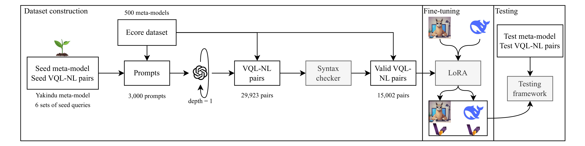

# Text2VQL: Teaching a Model Query Language to Open-Source Language Models with ChatGPT

This is the codebase of the paper "Text2VQL: Teaching a Model Query Language to Open-Source Language Models with ChatGPT".

## Repository structure

The repository is structured as follows:
* The `dataset_construction` contains all the procedures to generate the synthetic dataset of VQL-NL pairs.
* The `training` folder contains all the scripts to fine-tune open-source LLMs using the synthetic dataset.
* The `results` contains the results presented in the paper and the scripts needed to execute the testing framework.
* The `eclipse-rdp` folder contains the docker set-up for the Java scripts.

## Running everything
To reproduce the full paper, the order is the following:
1. Run the scripts of `eclipse-rdp` to build the docker image and run the container.
2. Run the scripts of `dataset_construction`.
3. Run the scripts of `training`.
4. Run the scripts of `results`.

For each phase/folder, you have to move the working directory to the associated folder (e.g., `cd eclipse-rdp`).
Each phase/folder has its own `README.md` explaining all the requirements and steps.

The `results` folder contains not only the scripts used to answer all the RQs but also
the data associated to the paper. Therefore, if you start running all the scripts from the very first phase,
you will eventually overwrite all this data.

## Requirements

The hardware and software requirements are the following.

* One NVIDIA RTX A5000 GPU for training and running the open-source models.
* Ubuntu OS.
* [Conda](https://docs.anaconda.com/free/miniconda/).
* [Docker engine](https://docs.docker.com/engine/install/ubuntu/).
* All the phases have one `environment.yml` specifying the Python version and the required Python libraries.

## Licenses

The code of this repository is under the MIT LICENSE (`LICENSE-CODE`). The models and dataset associated to the paper 
(uploaded to [HuggingFace](https://huggingface.co/PELAB-LiU)) are under a research-only LICENSE (`LICENSE-MODEL-DATA`).

The repository includes a modified copy of [refinery](https://github.com/graphs4value/refinery) under `eclipse-rdp/refinery` 
which is provided under `Eclipse Public License - v 2.0`.